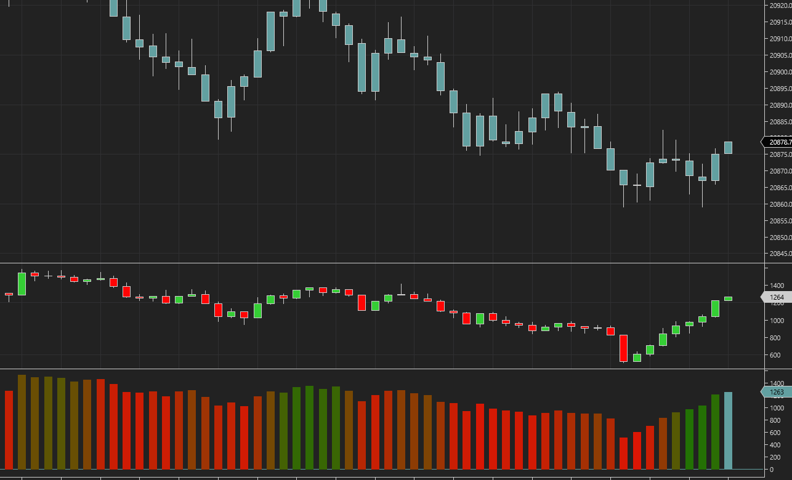

**Requires the lifetime NinjaTrader license for the volumetric data or the Order Flow + subscription.**

Histogram with statical methods for scoring trend for the cumulative delta bars. Cumulative delta bars are for reference.

The TrendClassifier evaluates market trends using statistical methods. It combines three trend detection techniques—Ordinary Least Squares (OLS) regression slope, Mann-Kendall tau, and Sen's slope—to produce a normalized trend score between -1 and 1.

**How It Works**

Extracts the most recent prices within the period and computes:

- OLS slope (linear trend strength and direction)
- Mann-Kendall tau (non-parametric trend consistency)
- Sen's slope (robust rate of change)

It then normalizes and weights each metric by its statistical significance and outputs a composite score, where:

+1 = strong uptrend

-1 = strong downtrend

0 = neutral/insignificant trend

Add-On Download: https://github.com/WaleeTheRobot/cumulative-delta-trend-score/releases
